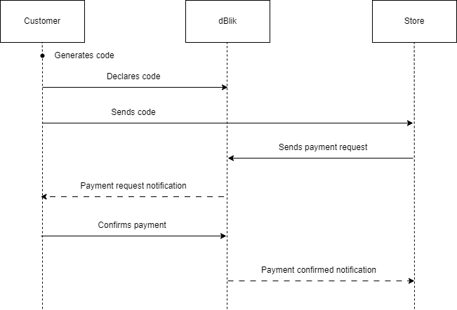

    

<h1 style="margin:10px;">
dBlik 
</h1>

Distributed [BLIK](https://www.blik.com/)-like app using the Solana blockchain infrastructure.

---

## Motivations
The main goal is to learn about smart contracts and work in other languages than my native C#. The Solana blockchain was chosen rather accidentally, although the most important criteria were low transaction fees and popularity. I enjoy challenges, so I've chosen a topic I wasn't sure if it was possible to accomplish.

## Overview

## Roadmap
- [x] Preliminary research
- [ ] MVP
    - [ ] On-chain program
    - [ ] Local demo
- [ ] Optional
    - [ ] Public demo
    - [ ] Integration with chosen e-commerce platform
    - [ ] Mobile application
    - [ ] Reusing Storage Accounts to reduce transaction fees

## Research and conclusions
### Generating random code

As it is known, my application relies on generating random codes, which is not feasible within the domain of blockchain. Additionally, all data on the blockchain is public. While I discovered solution like [Switchboard Randomness](https://docs.switchboard.xyz/randomness), which allows for providing VRF (Verifiable Random Function), it's too expensive for generating a one-time code.

Therefore, I decided to generate the code off-chain.

### Thousands of transactions at the same time

I was wondering how to store temporary (or not) transaction data. I tried using [Zero Copy Account](https://solana.com/docs/core/accounts#creating), which allows for storing a larger (max 10 MiB vs 10 KiB), but still limited, amount of data. However, I didn't have a solution for handling entry deletions.

I came up with the idea of creating a new Storage Account for each transaction, with a custom address generated, using a random code and timestamp as the seed. In consequence, I don't need to store any references in any central location.

### Generating address from the seed

The built-in function `anchor.web3.SystemProgram.createAccountWithSeed()` [caused the seed to be visible](https://explorer.solana.com/tx/4a2Ra4p59sJeZ4c877xd6hfieqRxSr52begUJKXYDkq9ARPYMotRhwbzD5k8DoD3Ce17qZ6GbudQYUm7vfBK411w?cluster=devnet). 

So, I've decided to use the standard method `anchor.web3.SystemProgram.createAccount()`, in which I can declare separately generated keys and sign the transaction.

## Vulnerabilities

Currently, I see one vulnerability, where a thief subscribes to changes on hundreds of thousands of Storage Accounts with pre-generated addresses and, after notification, sends a payment request.

The only solution that comes to mind, besides comparing the transaction amount, is attaching custom information from the store, such as the name and internal transaction ID. However, this still requires caution from the user.

## Setup
TBD

https://stackoverflow.com/questions/72037340/install-anchor-cli-on-windows-using-cargo

https://www.anchor-lang.com/docs/installation
