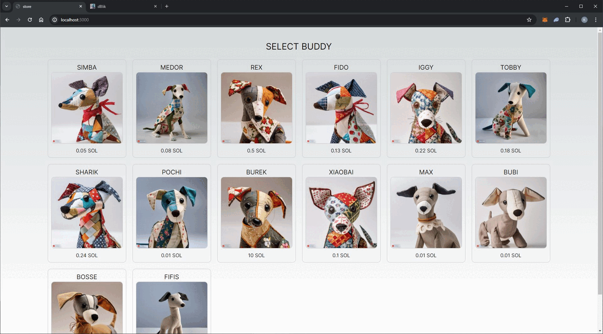

<div align="center">

<a href="https://dblik.vercel.app/"></a>

<h1>dBlik</h1>

Distributed [BLIK ↗](https://www.blik.com/)-like app using the Solana blockchain infrastructure.

</div>

---

[](https://github.com/Karlos348/dBlik)
[](https://dblik.vercel.app/)


## Motivations
The main goal is to learn about smart contracts and work in other languages than my native C#. The Solana blockchain was chosen rather accidentally, although the most important criteria were low transaction fees and popularity. I enjoy challenges, so I've chosen a topic I wasn't sure if it was even possible to accomplish.

## Demo
Web application is available with a dedicated sample store:
- [dBlik: https://dblik.vercel.app/](https://dblik.vercel.app/)
- [store: https://dblik-store.vercel.app/](https://dblik-store.vercel.app/)

It works on the [Devnet cluster ↗](https://explorer.solana.com/address/EE4v8mDaBcnXjYakNPUExR1DGZXS4ba4vyBSrqXXRRF3?cluster=devnet) and requires installing a wallet, such as [Phantom ↗](https://phantom.app/) or [Solflare ↗](https://solflare.com/). After creating an account in Devnet network, you can get funds using the [Faucet  ↗](https://faucet.solana.com/).

#### IMPORTANT
Make sure your wallet is set to testnet mode.


## Overview

### Happy path

<div align="center">




</div>

### Transaction window

Codes are generated in 10-minute windows. This means that if a code is generated at 21:36, one of the seed components will be '21:30'. When checking the code at 21:41, it is necessary to check both 21:30 and 21:40, as it is within the overlap zone.

Assuming half of the possible code pool (450k) is used, it is possible to conduct 23.5 billion transactions annually. This allows for over 20 times more transactions than [were conducted in 2023 with the original product in Poland ↗](
https://www.blik.com/blik-podsumowuje-2023-r-blisko-1-8-mld-transakcji-i-3-mln-nowych-uzytkownikow). Reducing the window to 5 minutes would enable nearly 50 billion transactions.

<div align="center">


</div>

## Roadmap
- [x] Preliminary research
- [x] MVP
    - [x] On-chain program with basic functionality
    - [x] Local demo
- [ ] Testing and feedback
    - [x] Public demo
    - [ ] Cover the program with tests
- [ ] Optional
    - [x] Refunding overdue funds in the Transaction Account
    - [x] Transaction cancellation by customer
    - [x] Transaction expiration by store
    - [ ] Integration with chosen e-commerce platform
    - [ ] Mobile application

## Research and conclusions
### Generating random code

As it is known, the application relies on generating random codes, which is not feasible within the domain of blockchain. Additionally, all data on the blockchain is public. While I discovered solution like [Switchboard Randomness ↗](https://docs.switchboard.xyz/docs/switchboard/switchboard-randomness), which allows for providing VRF (Verifiable Random Function), it's too expensive for generating a one-time code.

Therefore, I've decided to generate the code off-chain.

### Thousands of transactions at the same time

I was wondering how to store temporary (or not) transaction data. I tried using [Zero Copy Account ↗](https://solana.com/docs/core/accounts#creating), which allows for storing a larger (max 10 MiB vs 10 KiB), but still limited, amount of data. However, I didn't have a solution for handling entry deletions.

I came up with the idea of creating a new Storage Account for each transaction, with a custom address generated, using a random code and timestamp as the seed. In consequence, I don't need to store any references in any central location.

### Generating address from the seed

The built-in function `anchor.web3.SystemProgram.createAccountWithSeed()` [caused the seed to be visible ↗](https://explorer.solana.com/tx/4a2Ra4p59sJeZ4c877xd6hfieqRxSr52begUJKXYDkq9ARPYMotRhwbzD5k8DoD3Ce17qZ6GbudQYUm7vfBK411w?cluster=devnet). 

So, I've decided to use the standard method `anchor.web3.SystemProgram.createAccount()`, in which I can declare separately generated keys and sign the transaction.

## Vulnerabilities

The attacker, by subscribing to changes in the program, can easly obtain the account address with transaction data. They can send a payment request without knowing the code.

One solution that comes to mind first, besides comparing the transaction amount, is attaching additional custom information from the store, such as the name and internal transaction ID. However, this still requires caution from the user.

Another option is to charge the store a refundable fee for hooking up to the transaction, which will be refunded regardless of the success of the transaction.

## Setup

Download the project using Git
```sh
git clone https://github.com/Karlos348/dBlik.git
```

### dBlik - client

#### Requirements:
Node.js >= 20.x

#### Stages to run
Go to the project directory
```
cd ./app/dblik
```
Create `.env.local` file by copying the default values from `.env.prod`
```
cp .env.prod .env.local
```
Intall the dependencies
```
npm install
```
Run application
```
npm run dev
```

### dBlik - smart contract (program)

[Install system dependencies ↗](https://solana.com/developers/guides/getstarted/setup-local-development#1-installing-dependencies)

[Install Rust and Cargo ↗](https://solana.com/developers/guides/getstarted/setup-local-development#2-install-rust)

[Install Solana CLI ↗](https://solana.com/developers/guides/getstarted/setup-local-development#3-install-the-solana-cli)

[Install Anchor ↗](https://www.anchor-lang.com/docs/installation)

(Windows only) Use WSL
```
wsl
```

Create and set wallet (using WSL start PATH with `/mnt/c`, for example `/mnt/c/Users/Profile/.config/solana/id.json`)
```
solana-keygen new -o PATH/id.json
solana config set -k PATH/id.json
```

Set Devnet cluster
```
solana config set -u devnet
```

Request airdrop
```
solana airdrop 2
```

2 SOL may not be sufficient to deploy the program, so use [Faucet  ↗](https://faucet.solana.com/) to get more.

Create program id:
```
solana-keygen new --no-outfile
```

tbd


### dBlik - sample store

tbd